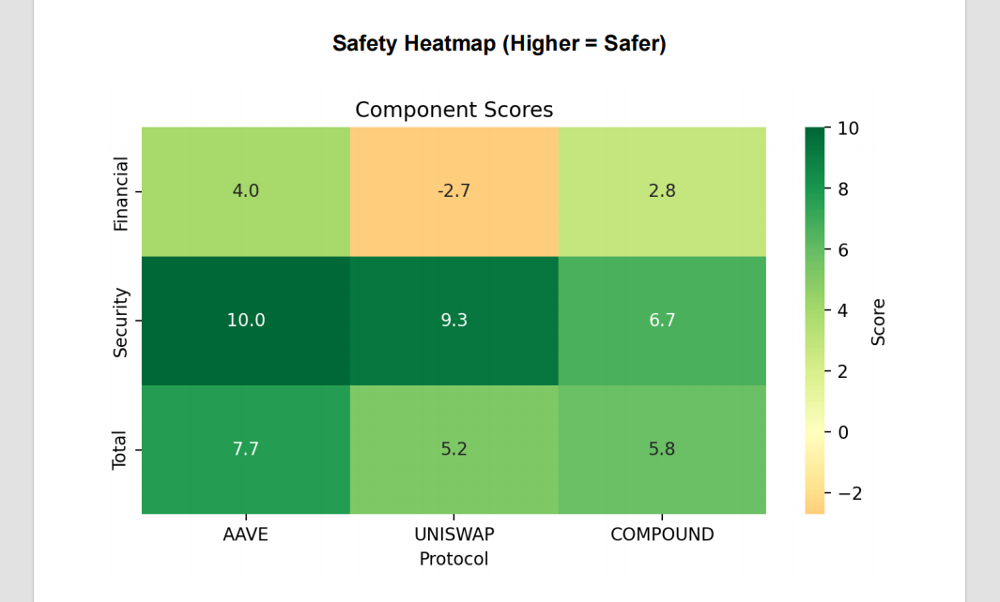
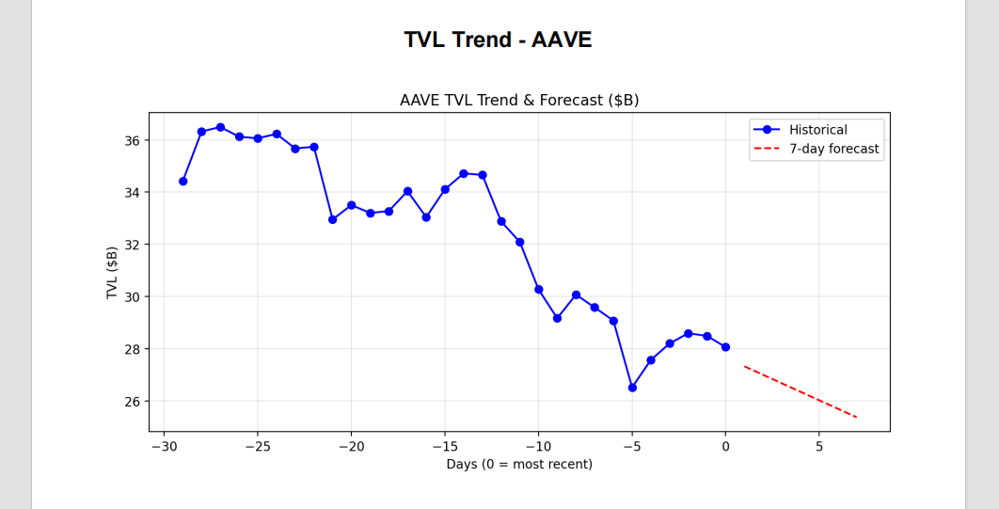

# DeFi Protocol Safety Scoring Tool

A lightweight, transparent Python tool that generates a quick safety/risk assessment report for major DeFi protocols (Aave, Uniswap, Compound). It combines live market data, TVL trends, historical security events, audit recency and bug bounty status into a single composite score and exports everything as a clean PDF report with charts and heatmaps.

Built to run in Google Colab with minimal dependencies — no blockchain scanners (Slither, Mythril), no heavy ML, just APIs + basic stats.

**Sample report output (Feb 2026 data):**




(Full example pages in the `screenshots/` folder.)

## Features

- **Live data fetching** from CoinGecko (token metrics), DefiLlama (TVL & chains), GitHub (code freshness)
- **Fallback cache** for flaky APIs (common in Colab) with clear sourcing notes
- **Composite safety score** (0–10): blends financial health (TVL scale, price momentum, volatility, trend) + security track record (exploits, audits, bounties)
- **Visual outputs**: PDF report including summary tables, component heatmap and per-protocol TVL trend + 7-day linear forecast
- **Transparent methodology**: scores are explainable, weights are documented, historical issues are listed

## Example Report Summary (Feb 2026 snapshot)

| Protocol  | Total Score | Risk Level   | Financial | Security | TVL     | Trend     | Exploits | Key Notes                              |
|-----------|-------------|--------------|-----------|----------|---------|-----------|----------|----------------------------------------|
| AAVE      | 7.66/10     | LOW RISK     | 3.97/10   | 10.00/10 | $46.5B  | Declining | 0        | Strong audits (2025–2026), $1.0M bounty |
| UNISWAP   | 5.21/10     | MEDIUM RISK  | -2.71/10  | 9.33/10  | $3.1B   | Declining | 0        | $15.5M bounty, no core exploits        |
| COMPOUND  | 5.82/10     | MEDIUM RISK  | 2.79/10   | 6.67/10  | $2.0B   | Declining | 1        | 2021 exploit ($147M mitigated), older audits |

- **Data sources**: Live API where possible; fallback to Feb 2026 cache otherwise (noted in report footer)
- **Security highlights**: Aave near-perfect due to recent audits; Uniswap benefits from massive bounty; Compound penalized for dated audits & history

## How It Works (Methodology)

### Financial Score Components
- TVL scale (capped contribution)
- Price momentum (7d + 30d % change, normalized)
- Volatility penalty (absolute 30d change)
- TVL trend slope (linear regression on last 30 days)

### Security Score Components
- Starts at 10, subtracts for known exploits (weighted heavier if recent)
- Bonuses for audit recency/count (2025+ preferred) and active bug bounty
- Penalties for old audits or noted (even mitigated) vulnerabilities

All weights and logic are in the notebook — easy to tweak.

## Installation & Usage (Google Colab – Recommended)

1. Open the notebook directly in Colab:  
   [](https://colab.research.google.com/github/GeorgeKGM2058/DeFi-Protocol-Safety-Scoring-Tool/blob/main/DeFi-Protocol-Safety-Scoring-Tool.ipynb)

2. Run all cells (top to bottom). It installs minimal packages (`scikit-learn`, `fpdf2`) quietly.

3. The final cell:
   - Analyzes Aave, Uniswap, Compound
   - Generates `DeFi_Safety_Report.pdf`
   - Auto-downloads it

No local setup needed. Takes ~30–90 seconds.

## Local Run (Optional)

```bash
# Clone repo
git clone https://github.com/GeorgeKGM2058/DeFi-Protocol-Safety-Scoring-Tool.git
cd DeFi-Protocol-Safety-Scoring-Tool

# Install deps (Python 3.9+)
pip install -r requirements.txt   # create this file if needed: scikit-learn fpdf2 pandas numpy matplotlib seaborn requests

# Open & run the .ipynb in Jupyter / VS Code / etc.
```

## Limitations & Disclaimers

- **Not financial/investment advice** — this is an educational/exploratory tool using public APIs and hardcoded historical summaries.
- **No on-chain code analysis** — relies on public reports (Rekt.news, protocol docs, Immunefi/Cantina bounties).
- **API flakiness** — CoinGecko/DefiLlama/GitHub can rate-limit or fail → fallback data used (noted in output).
- **Static historical security** — does not detect new unreported issues or live vulnerabilities.
- **Linear trend forecast** — simple extrapolation, not predictive modeling.

Use as a starting point for deeper research, not sole decision-making.

## Data Sources

- Market metrics: [CoinGecko API](https://www.coingecko.com/en/api)
- TVL & chains: [DefiLlama API](https://defillama.com/docs/api)
- Bug bounties: Immunefi (Aave, Compound), Cantina (Uniswap)
- Exploits & audits: Public sources (Rekt.news, protocol docs, GitHub)
- Code freshness: GitHub last commit API

## License

MIT License — see [LICENSE](LICENSE) file.

Built throughout 2025, updated February 2026.

```
