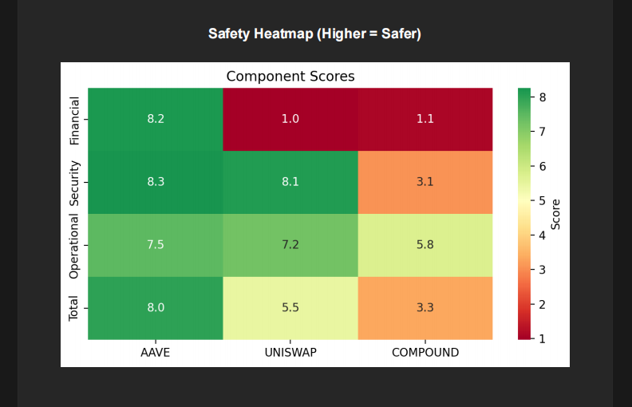
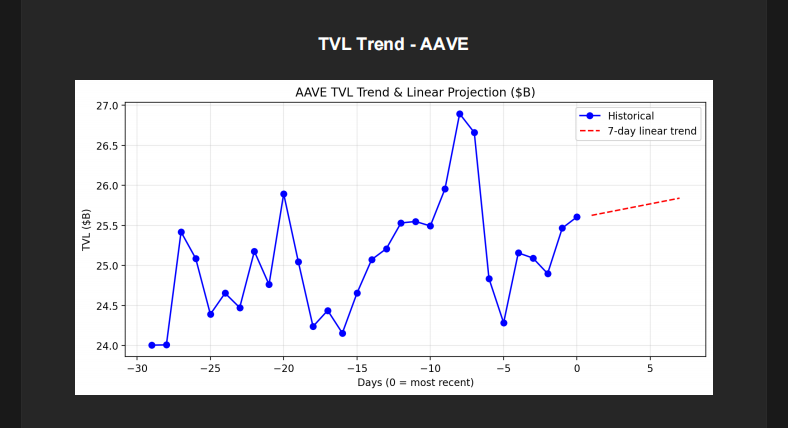

# DeFi Protocol Safety Scoring Tool

A lightweight, transparent Python tool that generates a quick safety/risk assessment report for major DeFi protocols (Aave, Uniswap, Compound). It combines live market data, TVL trends, historical security events, audit recency and bug bounty status into a single composite score and exports everything as a clean PDF report with charts and heatmaps.

Built to run in Google Colab with minimal dependencies, so no blockchain scanners (Slither, Mythril), no heavy ML, just APIs + basic stats.


**Sample report output (March 2026 data):**





**Full sample report (PDF):**  
[DeFi_Safety_Report.pdf](https://github.com/GeorgeKGM2058/DeFi-Protocol-Safety-Scoring-Tool/blob/main/sample_report/DeFi_Safety_Report.pdf)


## Features

- **Live data fetching** from CoinGecko (token metrics), DefiLlama (TVL & chains), GitHub (code freshness)
- **Fallback cache** for flaky APIs (common in Colab) with clear sourcing notes
- **Composite safety score** (0–10): blends financial health (TVL scale, price momentum, 30d price swing, TVL trend) + security track record (exploits, audits, bounties, governance surface, formal verification) + operational risk (oracle dependency, bridge exposure, chain concentration, development activity)
- **Visual outputs**: PDF report including summary tables, component heatmap and per-protocol TVL trend + 7-day linear forecast
- **Transparent methodology**: scores are explainable, weights are documented, historical issues are listed


## Example Report Summary (March 2026 snapshot)

| Protocol | Total Score | Risk Level  | Financial | Security | Operational | TVL    | Trend             | Exploits |
|----------|-------------|-------------|-----------|----------|-------------|--------|-------------------|----------|
| AAVE     | 7.93/10     | LOW RISK    |  8.02     | 8.26     | 7.50        | $25.4B | Stable/Increasing | 0        |
| UNISWAP  | 5.43/10     | MEDIUM RISK |  0.90     | 8.13     | 7.25        | $3.2B  | Stable/Increasing | 0        |
| COMPOUND | 1.81/10     | HIGH RISK   | -3.39     | 3.06     | 5.75        | $1.4B  | Stable/Increasing | 1        |

- **Data sources**: Live API where possible. Fallback to Feb 2026 cache otherwise (noted in report footer)
- **Security highlights**: Aave leads with 8.26 thanks to recent V4 2026 audits and zero core exploits. Uniswap is close behind at 8.13 despite medium governance concentration. Compound trails at 3.06 due to a 2021 exploit, pre-2023 audit staleness and near-zero recent development activity
- **Operational highlights**: Aave is penalized for Ethereum chain concentration (>70% TVL) despite high commit activity. Uniswap and Compound are both penalized for <5 commits on their core repos in the last 90 days. Compound is additionally penalized for Chainlink-only oracle with no fallback.
- **Financial note**: The most volatile component is driven by live 7d token price momentum at run time. Values will shift on every run with market conditions


## How It Works (Methodology)

### Financial Score Components
- TVL scale (capped contribution)
- Price momentum (7d % change, normalized)
- 30d price swing penalty (absolute 30d return, directional sign dropped. Realized price risk proxy, not the same as the momentum signal above)
- TVL trend slope (linear regression on last 30 days)

### Security Score Components
- Starts at 10, subtracts for known exploits
- Bonuses for audit recency/count (2025+ preferred) and active bug bounty
- Penalties for old audits or noted (even mitigated) vulnerabilities

### Operational Score Components
- **Emergency pause capability**: −0.5 if the protocol has no pause function (e.g. Uniswap V4 core is immutable. Operationally riskier on zero-day discovery, even if immutability is a security property)
- **Oracle dependency**: 0 / −0.5 / −1.5 for none / medium / high. Single-source oracle failure can freeze liquidations or enable price manipulation.
- **Bridge exposure**: −0.5 if the protocol has active cross-chain integrations (each bridge is an additional attack surface).
- **Chain concentration** (live from DefiLlama): −0.75 if top chain holds 50–70% of TVL, −1.5 if >70%. Single-chain concentration is a liquidity and operational risk
- **Development activity** (live from GitHub): −0.5 if <20 commits on the core repo in the last 90 days, −1.5 if <5. Near-zero activity on a $1B+ TVL protocol signals maintenance risk.

This produces round numbers by design since the inputs are discrete thresholds, which is expected, not a bug.

All weights and logic are in the notebook, easy to tweak.


## Installation & Usage (Google Colab – Recommended)

1. Open the notebook directly in Colab:  
   [](https://colab.research.google.com/github/GeorgeKGM2058/DeFi-Protocol-Safety-Scoring-Tool/blob/main/DeFi_Protocol_Safety_Scoring_Tool.ipynb)

2. Run all cells (top to bottom). It installs minimal packages (`scikit-learn`, `fpdf2`) quietly.

3. The final cell:
   - Analyzes Aave, Uniswap, Compound
   - Generates `DeFi_Safety_Report.pdf`
   - Auto-downloads it

No local setup needed. Takes ~30–90 seconds.


## Local Run (Optional)

```bash
# Clone repo
git clone https://github.com/GeorgeKGM2058/DeFi-Protocol-Safety-Scoring-Tool.git
cd DeFi-Protocol-Safety-Scoring-Tool

# Install deps (Python 3.9+)
pip install -r requirements.txt   # scikit-learn fpdf2 pandas numpy matplotlib seaborn requests

# Open & run the .ipynb in Jupyter / VS Code / etc.
```


## Limitations & Disclaimers

- **Not financial/investment advice.** This is an exploratory tool using public APIs and hardcoded summaries.
- **No on-chain code analysis**, in order to keep it light, fast and compatible with Google Colab. Relies on based public reports instead (Rekt.news, protocol docs, Immunefi/Cantina bounties).
- **API flakiness.** CoinGecko/DefiLlama/GitHub can rate-limit or fail in which case fallback data is used and is noted in output.
- **Static historical security.** Does not detect new unreported issues or live vulnerabilities unless updated.
- **Linear trend forecast.** Simple extrapolation, not predictive modeling.

Could be used as a starting point for deeper research, not sole decision-making.


## API Rate Limits & How to Avoid Them

The three APIs used have free-tier rate limits that can cause fallback data to be used, especially in Colab where IP addresses are shared:

- **CoinGecko** (about 30 requests/min on the free tier): the notebook already sleeps 1.5s between protocol calls. If you hit it repeatedly in one session, wait 2–3 minutes before re-running.
- **DefiLlama** (no official stated limit but seems pretty restricting at times). If TVL falls back, simply re-run the cell, it usually resolves on retry.
- **GitHub** (60 unauthenticated req/hour per IP): the notebook makes 3 requests per protocol (latest commit, 90-day commits, repo metadata) = 9 total.

When fallback data is used, the report labels it explicitly (`Data Source: Partial fallback`) and the PDF footer notes it. The financial score is the most sensitive to this.


## Data Sources

- Market metrics: [CoinGecko API](https://www.coingecko.com/en/api)
- TVL & chains: [DefiLlama API](https://defillama.com/docs/api)
- Bug bounties: Immunefi (Aave, Compound), Cantina (Uniswap)
- Exploits & audits: Public sources (Rekt.news, protocol docs, GitHub)
- Code freshness: GitHub last commit API


*Built throughout 2025, updated early 2026.*
